# 🏦 Banking Management System

A **console-based Banking Management System** developed using **Java, JDBC, MySQL, OOP, and File Handling**. The application provides complete banking operations including customer management, account management, deposits, withdrawals, fund transfers, transaction history tracking, receipt generation, validations, and administrative dashboard reporting.

---

## 📌 Features

### 👤 Customer Management
- Add Customer
- View All Customers
- Search Customer by ID
- Update Customer Details
- Delete Customer (with account dependency validation)

### 💳 Account Management
- Create Bank Account
- View All Accounts
- Search Account by Account Number
- Update Account Status
- Close Account

### 💰 Banking Transactions
- Deposit Money
- Withdraw Money
- Transfer Funds Between Accounts
- Check Account Balance

### 📜 Transaction Tracking
- Record all transactions in database
- Track Deposits
- Track Withdrawals
- Track Transfer Debits
- Track Transfer Credits
- View Transaction History

### 📄 Receipt Generation
- Automatic receipt generation using File Handling
- Unique timestamp-based receipt files
- Stores transaction details in `.txt` format

### ✅ Validation Layer
- Customer name validation
- Email validation
- Phone number validation
- Account type validation
- PIN validation
- Amount validation
- Status validation
- Same-account transfer prevention

### 📊 Admin Dashboard
- Total Customers
- Total Accounts
- Active Accounts
- Closed Accounts
- Blocked Accounts
- Total Bank Balance
- Average Balance
- Highest Balance Account
- Lowest Balance Account

---

## 🛠️ Tech Stack

- **Java**
- **JDBC**
- **MySQL**
- **Object-Oriented Programming (OOP)**
- **File Handling**
- **IntelliJ IDEA**
- **MySQL Workbench**
- **Git & GitHub**

---

## 📂 Project Structure

```text
Banking-Management-System
│
├── database
│   └── bank_management_system.sql
│
├── receipts
│   └── Generated Transaction Receipts
│
├── screenshots
│
├── src
│   ├── config
│   │   └── DBConnection.java
│   │
│   ├── dao
│   │   ├── CustomerDAO.java
│   │   ├── AccountDAO.java
│   │   ├── TransactionDAO.java
│   │   └── AdminDAO.java
│   │
│   ├── model
│   │   ├── Customer.java
│   │   └── Account.java
│   │
│   ├── service
│   │   └── BankService.java
│   │
│   ├── util
│   │   └── ReceiptGenerator.java
│   │
│   └── Main.java
│
├── .gitignore
└── README.md
```

---

## 🗄️ Database Schema

### Customers Table

```sql
CREATE TABLE customers (
    customer_id INT PRIMARY KEY AUTO_INCREMENT,
    name VARCHAR(100) NOT NULL,
    email VARCHAR(100) UNIQUE NOT NULL,
    phone VARCHAR(15) UNIQUE NOT NULL,
    address VARCHAR(255),
    created_at TIMESTAMP DEFAULT CURRENT_TIMESTAMP
);
```

### Accounts Table

```sql
CREATE TABLE accounts (
    account_id INT PRIMARY KEY AUTO_INCREMENT,
    account_number BIGINT UNIQUE NOT NULL,
    customer_id INT NOT NULL,
    account_type VARCHAR(50) NOT NULL,
    balance DECIMAL(12,2) DEFAULT 0.00,
    pin INT NOT NULL,
    status VARCHAR(20) DEFAULT 'ACTIVE',
    created_at TIMESTAMP DEFAULT CURRENT_TIMESTAMP,
    FOREIGN KEY (customer_id) REFERENCES customers(customer_id)
);
```

### Transactions Table

```sql
CREATE TABLE transactions (
    transaction_id INT PRIMARY KEY AUTO_INCREMENT,
    account_number BIGINT NOT NULL,
    transaction_type VARCHAR(50) NOT NULL,
    amount DECIMAL(12,2) NOT NULL,
    balance_after DECIMAL(12,2),
    transaction_date TIMESTAMP DEFAULT CURRENT_TIMESTAMP
);
```

---

## 🚀 How to Run

### 1️⃣ Clone Repository

```bash
git clone https://github.com/Abhishek-Savita-3012/Banking-Management-System.git
```

### 2️⃣ Open Project

Open the project in:

```text
IntelliJ IDEA
```

### 3️⃣ Setup Database

Run:

```sql
database/bank_management_system.sql
```

in MySQL Workbench.

### 4️⃣ Configure Database Credentials

Update `DBConnection.java`

```java
private static final String URL =
"jdbc:mysql://localhost:3306/bank_management_system";

private static final String USER = "root";

private static final String PASSWORD = "your_password";
```

### 5️⃣ Run Application

Execute:

```text
Main.java
```

---

# 📸 Screenshots

## Project Structure

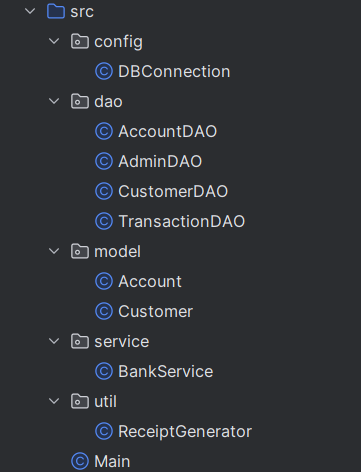

## Database Tables

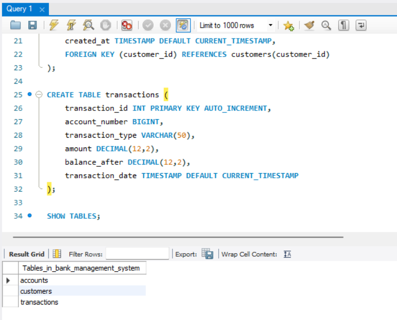

## Main Menu

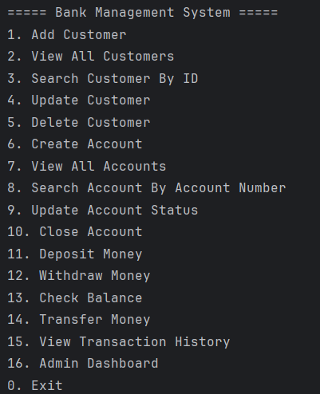

## Customers Table Data

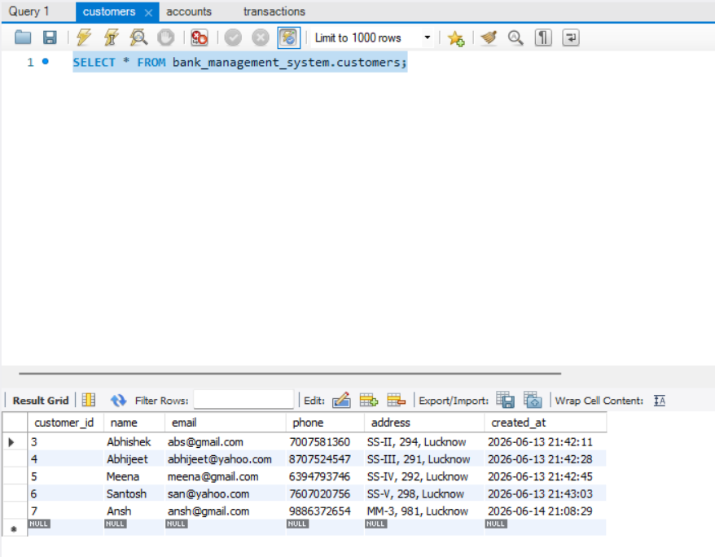

## Accounts Table Data

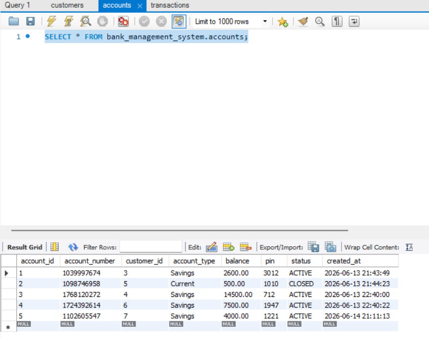

## Add Customer

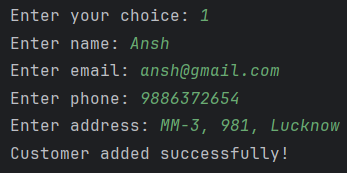

## View Customers

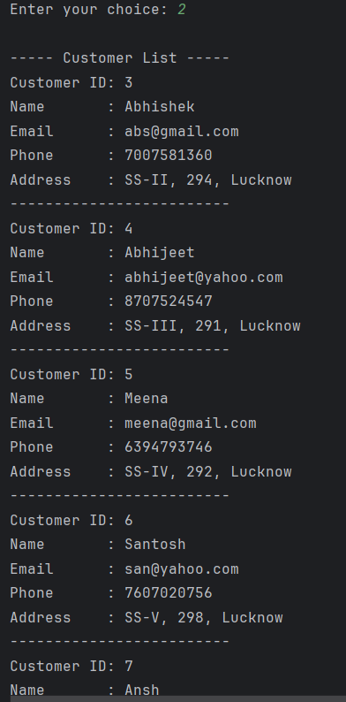

## Create Account

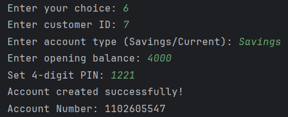

## View Accounts

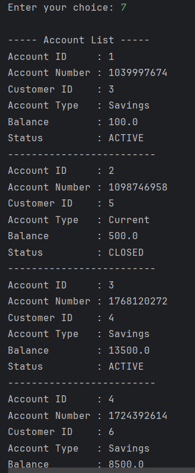

## Deposit Money

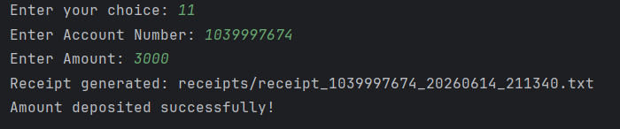

## Withdraw Money

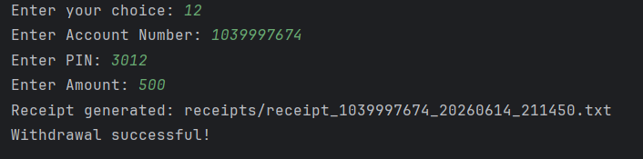

## Transfer Money

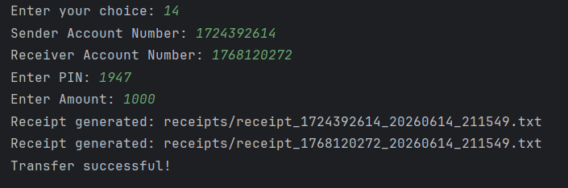

## Transaction History

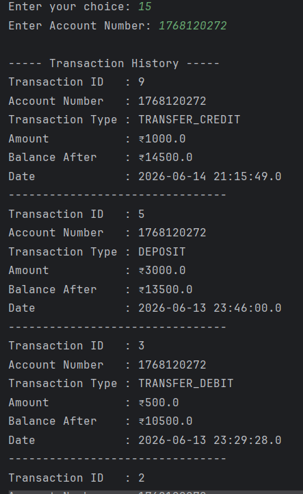

## Receipt Generation

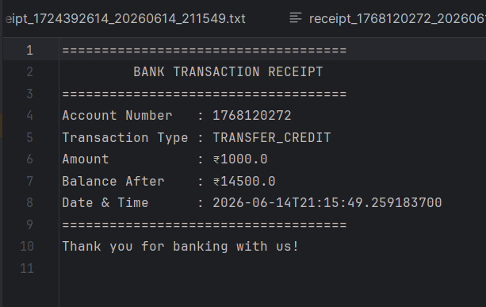

## Admin Dashboard

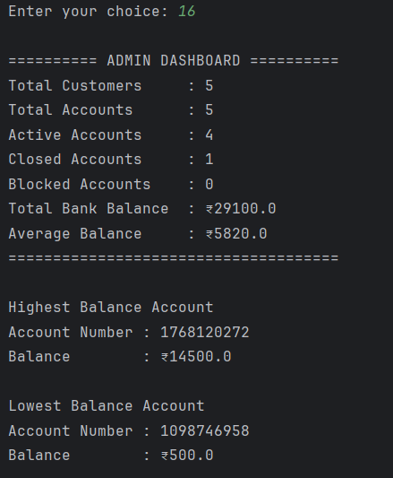

## Transactions Table Data

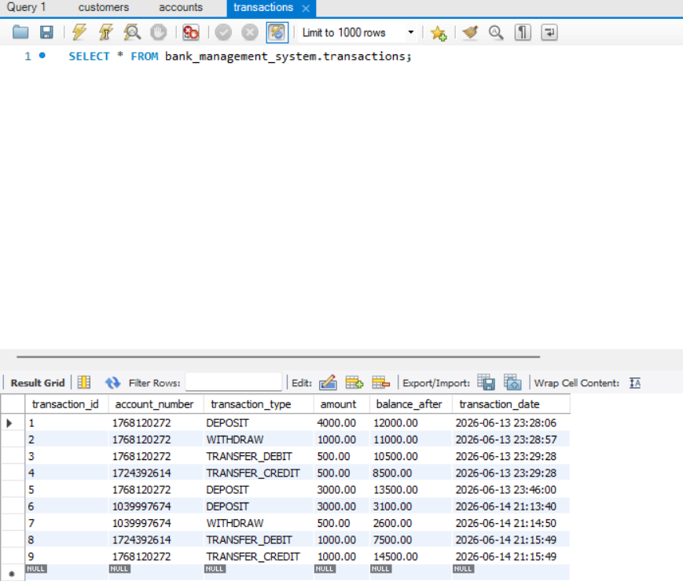

---

## 🎯 Learning Outcomes

This project demonstrates:

- Java Programming
- JDBC Connectivity
- MySQL Database Integration
- CRUD Operations
- Foreign Key Relationships
- Object-Oriented Programming
- Exception Handling
- File Handling
- Validation Logic
- Layered Architecture
- Banking Transaction Processing

---

## 🔮 Future Enhancements

- Login Authentication
- Password Encryption
- Interest Calculation
- Mini Statement Generation
- Account Reactivation
- Monthly Transaction Reports
- GUI using Java Swing / JavaFX
- REST API Integration using Spring Boot

---

## 👨‍💻 Author

**Abhishek Savita**

- GitHub: https://github.com/Abhishek-Savita-3012

---

⭐ If you found this project useful, consider giving it a star!
